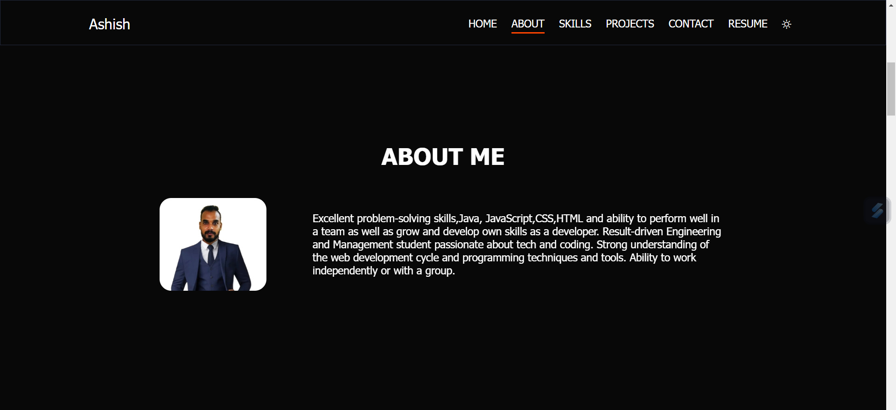
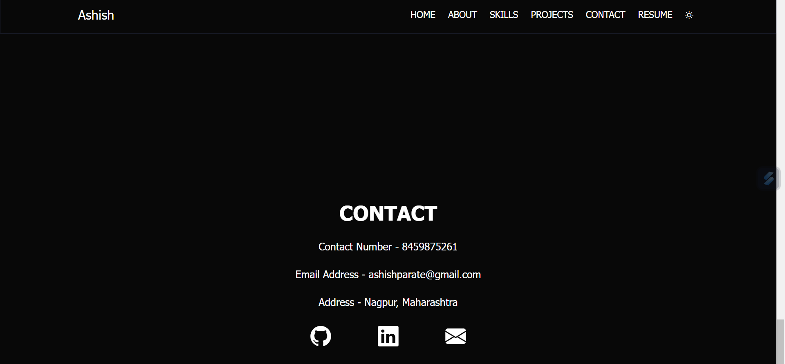

# Ashish Parate Protfolio

### Home Section

### About Section

### Skill Section

### Project Section

### Contact Section

## Features 📋
⚡️ Fully Responsive\
⚡️ Valid HTML5 & CSS3\
⚡️ User can Download Resume\
⚡️ Typing animation using `Typed.js`\
⚡️ Easy to modify\
⚡️ User can connect in different platforms

## Installation & Deployment 📦
- Clone the repository and modify the content of <b>index.html</b> 
- Update the info of `projects` folder according to your need
- Use [Github Pages](https://create-react-app.dev/docs/deployment/#github-pages) to create your own website.
- To deploy your website, first you need to create github repository with name `<your-github-username>.github.io` and push the generated code to the `master` branch.

## Sections 📚
✔️ About\
✔️ Skills \
✔️ Projects \
✔️ Resume\
✔️ Contact Info

